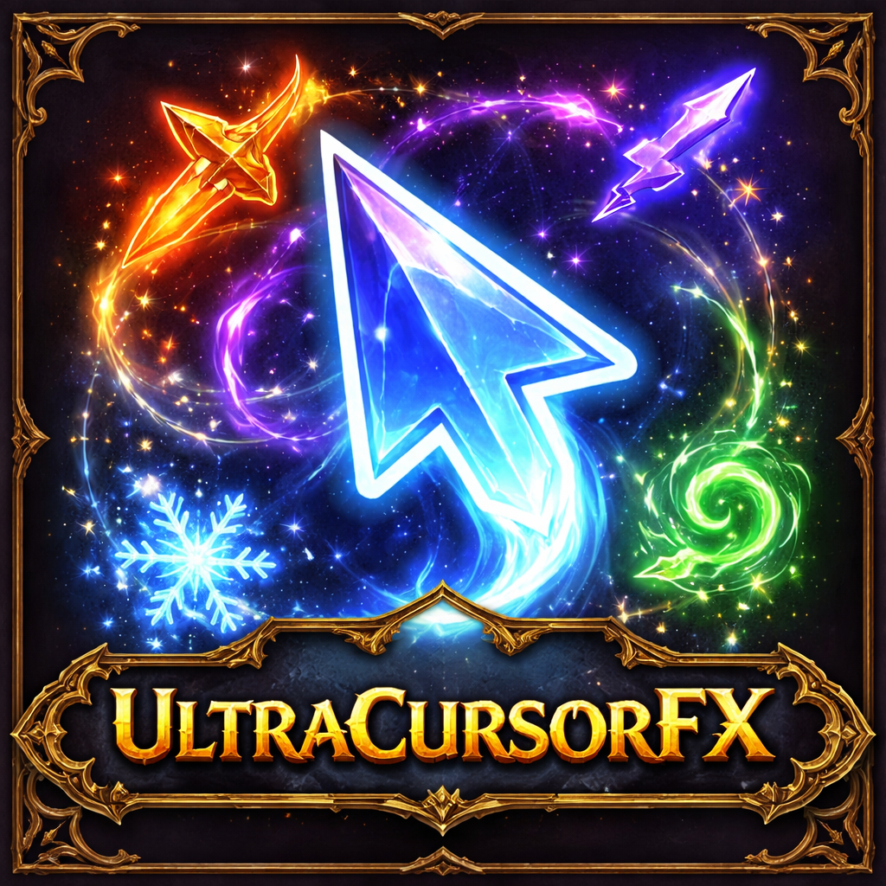

# UltraCursorFX ✨


[](https://www.curseforge.com/wow/addons/ultracursorfx)
[](https://github.com/Stackout/ultra-cursor-fx/releases)


## 🎯 **Stop Losing Your Cursor!**

### Are you constantly losing track of your mouse cursor during intense gameplay?
### Do you find yourself squinting at the screen, frantically waving your mouse around just to locate that tiny arrow?
### Tired of dying in raids because you couldn't see where you were clicking?

**You're not alone.** Many players—especially those with vision challenges, playing on large monitors, or in chaotic battle situations—struggle with the default cursor being nearly invisible.

**UltraCursorFX is an accessibility-focused addon that solves this problem.** With brilliant particle trails, customizable colors, and attention-grabbing effects, you'll **never lose your cursor again**.

---

## ♿ **Accessibility Features**

### **See Your Cursor Instantly**
- **Brilliant Particle Trails** - A glowing trail follows your cursor, making it visible even in cluttered combat
- **High-Contrast Colors** - Choose colors that stand out against any background
- **Customizable Size** - Make particles as large as you need (up to 100px!)
- **Pulsing Glow** - Rhythmic pulsing helps draw your eye to the cursor location

### **Perfect for:**
- 👓 Players with reduced vision or visual impairments
- 🖥️ Large monitor/ultrawide users where the cursor gets lost
- 👴👵 Older players who need enhanced visibility
- ⚔️ Anyone playing in chaotic raid/PvP situations
- 🌙 Night players who need better cursor contrast

---

## 🎨 Beyond Accessibility - Make It Your Own

### Core Effects
- **Screen Edge Warnings** ⚠️ *NEW!* - Never lose your cursor off-screen
  - Pulsing arrows appear when cursor approaches screen edges
  - Perfect for large/ultrawide monitors
  - Fully customizable distance, size, and opacity
- **Smart Reticle System** 🎯 - Dynamic crosshair that changes color based on targets
  - 6 authentic styles: Crosshair, Circle Dot, T-Shape, Military, Cyberpunk, Minimal
  - Red for enemies, green for friendlies, gold for objects
- **Customizable Particle Trails** - Beautiful trailing effects that follow your cursor
- **4 Particle Shapes** - Star ⭐, Skull 💀, Spark ✨, Circle ⚪
- **Rainbow Mode** 🌈 - Automatically cycle through rainbow colors
- **Click Effects** 💥 - Explosive particle bursts when you click
- **Comet Mode** ☄️ - Elongated, stretched-out comet tail effect
- **Pulse Animation** - Smooth pulsing glow effect

### Customization
- **Full Color Control** - Custom color picker + 6 color presets
- **Adjustable Trail Length** - 10-100 particles
- **Particle Size Control** - Customize both trail and glow size
- **Trail Smoothness** - From snappy to super smooth
- **Click Particle Settings** - Control burst size, duration, and particle count
- **Comet Tail Length** - Adjust the stretch effect
- **Opacity & Fade Control** ✨ *NEW* - Fine-tune visibility with global opacity, fade effects, and combat boost

### Quality of Life
- **Keybinding Support** - Bind keys to toggle features instantly
- **Slash Commands** - Quick toggles via `/ucfx` commands
- **Scrollable Settings Panel** - Clean, organized UI
- **Sane Defaults** - Works great out of the box!

---

## 📦 **Simple Installation**

### CurseForge (Easiest)
1. Download from [CurseForge](https://www.curseforge.com/wow/addons/ultracursorfx)
2. CurseForge app installs it automatically
3. Launch WoW - you're done!

### Manual Installation
1. Download the latest release
2. Extract the `UltraCursorFX` folder to:
   - **Windows**: `C:\Program Files (x86)\World of Warcraft\_retail_\Interface\AddOns\`
   - **Mac**: `/Applications/World of Warcraft/_retail_/Interface/AddOns/`
3. Launch WoW and enable at character select

**That's it!** Your cursor will now have a glowing cyan trail that's impossible to lose!

---

## 🚀 **Getting Started - Super Easy!**

The addon works **immediately** with smart defaults designed for maximum visibility.

### **First Time Setup (Optional)**
Type this in-game:
```
/ucfx
```
This opens the settings panel where you can customize everything.

### **Quick Commands - No Setup Needed**
```
/ucfx on         - Turn cursor trail on
/ucfx off        - Turn cursor trail off
/ucfx rainbow    - Rainbow colors (looks amazing!)
/ucfx click      - Burst effects when clicking
/ucfx edge       - Toggle screen edge warnings
/ucfx profiles   - Toggle situational profiles
```

---

## 🎯 **NEW: Situational Profiles**

**Automatically switch cursor effects based on your location!**

Different situations call for different cursor styles:
- **Raids** 🔥 - Intense red comet with enhanced click effects
- **Dungeons** 💜 - Purple trail optimized for group content
- **Arenas** ⚔️ - Fast orange spark perfect for PvP
- **Battlegrounds** 🏆 - Gold trail with balanced visibility
- **World** 🌍 - Your default comfortable settings

### **Upgrading from Previous Version?**
Don't worry! Your existing custom settings are automatically migrated to your World profile on first load. You won't lose any of your carefully configured settings!

### **How It Works**
1. Enable **Situational Profiles** in settings or type `/ucfx profiles`
2. Customize your cursor for each situation
3. Click **Save** to store that profile
4. The addon automatically switches when you enter that zone!

### **Managing Profiles**
```
/ucfx profiles               - Toggle auto-switching on/off
/ucfx save raid              - Save current settings to Raid profile
/ucfx load dungeon           - Load Dungeon profile
/ucfx save world             - Save to World (default) profile
```

Available profiles: `world`, `raid`, `dungeon`, `arena`, `battleground`

### **Example Workflow**
1. Configure cursor exactly how you want it for raids
2. Type `/ucfx save raid`
3. Change settings for world content
4. Type `/ucfx save world`
5. Enable profiles: `/ucfx profiles`
6. Done! Cursor auto-adjusts when you enter/leave raids

---

## ⚙️ Configuration

### Settings Panel
Access via `/ucfx` or **ESC → Interface → AddOns → UltraCursorFX**

**Basic Settings**
- Enable/Disable Trail
- Enable/Disable Pulse Flash

**Trail Settings**
- Trail Points (10-100) - Length of the trail
- Particle Size (10-100) - Size of each particle
- Glow Size (10-150) - Size of the glow effect
- Trail Smoothness (0.05-0.50) - How smoothly it follows your cursor
- Pulse Speed (0.5-5.0) - Speed of the pulsing animation

**Particle Shapes**
- **Star** ⭐ - Classic sparkly star
- **Skull** 💀 - Spooky skull marker
- **Spark** ✨ - Bright spark
- **Circle** ⚪ - Simple clean circle

**Color Settings**
- **Rainbow Mode** - Auto-cycling rainbow colors
- **Rainbow Speed** - How fast colors cycle
- **Custom Color Picker** - Choose any color you want
- **Presets** - Cyan, Purple, Green, Red, Gold, White

**Click Effects**
- Enable/Disable Click Bursts
- Click Particles (4-24) - Burst intensity
- Click Particle Size (20-100)
- Click Effect Duration (0.2-2.0s)

**Comet Mode**
- Enable/Disable Comet Effect
- Comet Tail Length (1.0-5.0) - Stretch multiplier

**Situational Profiles**
- Enable/Disable Auto-Switching
- Current Profile Display
- Manage 5 profiles: World, Raid, Dungeon, Arena, Battleground
- Save button - Store current settings to a profile
- Load button - Apply profile settings immediately

Each profile stores complete cursor configuration including colors, sizes, effects, and modes.

---

## 🔄 **Share Your Settings - NEW!**

Found the perfect configuration? **Share it with one click!**

### **Export Your Settings**
1. Type `/ucfx` to open settings
2. Scroll to **Import / Export** section
3. Click **Export** button
4. Press **Ctrl+C** to copy
5. Share the code with friends!

### **Import Someone's Settings**
1. Copy their settings code (starts with `UCFX:`)
2. Type `/ucfx` to open settings
3. Scroll to **Import / Export** section
4. Paste code and click **Import**
5. Done! You now have their exact setup.

**Command Line Options:**
```
/ucfx export              - Show your settings code in chat
/ucfx import <code>       - Import settings from a code
```

**Note:** Import/Export saves your current configuration, not situational profiles. Use profile commands for profile management.

Share your perfect accessibility setup with guild members, friends, or the community!

---

## 🎹 Keybindings

Set up keybinds in **ESC → Keybindings → UltraCursorFX**:

- **Toggle Cursor Trail** - Quick enable/disable
- **Toggle Pulse Flash** - Quick flash toggle
- **Toggle Rainbow Mode** - Quick rainbow toggle
- **Toggle Click Effects** - Quick click effects toggle
- **Toggle Comet Mode** - Quick comet toggle

---

## ♿ **Recommended Accessibility Setups**

### **Maximum Visibility (Best for Low Vision)**
- **Trail Points**: 60
- **Particle Size**: 80
- **Glow Size**: 120
- **Color**: White or Gold preset
- **Pulse Speed**: 2.5 (moderate)
- **Click Effects**: ON (24 particles)

*This creates a huge, bright trail that's impossible to miss.*

### **High Contrast for Dark Areas**
- **Color**: Cyan or White preset
- **Particle Size**: 60
- **Rainbow Mode**: OFF
- **Glow Size**: 90

*Perfect for dungeons and night gameplay.*

### **Gentle & Easy on Eyes**
- **Trail Points**: 40
- **Color**: Purple or Green preset
- **Pulse Speed**: 1.5 (slower)
- **Trail Smoothness**: 0.30 (smooth motion)

*Less flashy but still highly visible. Good for extended play sessions.*

---

## 🔥 **Fun Configurations**

Once you can see your cursor, why not make it spectacular?

### **Rainbow Comet 🌈☄️**
```
/ucfx rainbow
/ucfx comet
```
Set Comet Tail Length to 4.0, Trail Points to 80. Move your mouse in circles!

### **Skull Trail of Death 💀**
```
Shape: Skull
Color: Red preset
Trail Points: 70
Comet Mode: ON
```

### **Lightning Fast ⚡**
```
Trail Smoothness: 0.05
Pulse Speed: 5.0
Click Effects: 24 particles, 0.3s duration
```

### **Chill Vibes ✨**
```
Shape: Spark
Color: Purple preset
Trail Smoothness: 0.40
Pulse Speed: 1.0
Rainbow Mode: ON (slow speed 0.5)
```

---

## 🎮 **Situational Profile Examples**

Create the perfect cursor for every situation!

### **Raid Profile - High Intensity** 🔥
Focus on visibility during chaotic boss fights:
- **Color**: Red preset
- **Trail Points**: 40 (shorter for less clutter)
- **Particle Size**: 30
- **Comet Mode**: ON (2.5 length)
- **Click Effects**: 16 particles, larger size
- Save with: `/ucfx save raid`

### **Arena Profile - Maximum Reaction** ⚔️
Fast and flashy for competitive PvP:
- **Color**: Orange/Gold
- **Shape**: Spark
- **Trail Points**: 60
- **Trail Smoothness**: 0.12 (very responsive)
- **Pulse Speed**: 3.0
- **Click Effects**: 20 particles, short duration
- Save with: `/ucfx save arena`

### **Dungeon Profile - Balanced** 💜
Clear visibility without overwhelming visuals:
- **Color**: Purple preset
- **Trail Points**: 50
- **Particle Size**: 32
- **Click Effects**: Moderate (12 particles)
- Save with: `/ucfx save dungeon`

### **World Profile - Relaxed** 🌍
Comfortable for questing and exploration:
- **Color**: Cyan or custom
- **Rainbow Mode**: Optional
- **Trail Smoothness**: 0.20
- **Pulse Speed**: 2.5
- Save with: `/ucfx save world`

---

## 🛠️ Compatibility

- ✅ **World of Warcraft: Midnight** (Patch 12.0.0+)
- ✅ **The War Within** (Patch 11.0+)
- ✅ Works with all other addons
- ✅ No performance impact (highly optimized)

---

## 🐛 Known Issues

None currently! Report any bugs you find.

## 🤝 **Contributing**

Contributions are welcome! If you'd like to contribute to UltraCursorFX:

1. Fork the repository
2. Create your feature branch (`git checkout -b feature/AmazingFeature`)
3. **Run StyLua formatter before committing:**
```bash
   stylua .
```
4. Commit your changes (`git commit -m 'Add some AmazingFeature'`)
5. Push to the branch (`git push origin feature/AmazingFeature`)
6. Open a Pull Request

**Code Style:** This project uses [StyLua](https://github.com/JohnnyMorganz/StyLua) for consistent Lua formatting. All pull requests must be formatted with StyLua before submission.

**Install StyLua:**
```bash
# Via Cargo
cargo install stylua

# Via Homebrew
brew install stylua

# Via npm
npm install -g @johnnymorganz/stylua
```

---

## 💬 **Support & Community**

Found a bug? Have a feature request? Want to share your accessibility-friendly config?

- **Report Issues**: [GitHub Issues](#)
- **Suggestions**: We especially welcome accessibility improvement ideas!
- **Share Your Settings**: Use the export feature and share your setup codes with others!

**Help others see their cursor** - if you've found a great configuration, share it!

---

## 📝 **Changelog**

### v3.0.0 (Current)
- 🎯 **NEW: Situational Profiles** - Automatic cursor switching based on location!
- 🌍 5 Pre-configured profiles: World, Raid, Dungeon, Arena, Battleground
- 💾 Save/Load system for each profile
- 🔄 Automatic profile switching when entering instances
- 📊 Profile management UI in settings panel
- 💬 Profile slash commands (`/ucfx profiles`, `/ucfx save`, `/ucfx load`)
- ✨ Each profile stores complete cursor configuration

### v2.1.0
- 🔄 **NEW: Import/Export** - Share your settings with one click!
- ♿ Enhanced documentation for accessibility use cases
- 📤 Export settings to shareable code
- 📥 Import settings from friends or community
- 💬 Chat commands for import/export

### v2.0.0
- ✨ Added Rainbow Mode
- 💥 Added Click Effects
- ☄️ Added Comet Mode
- 🎨 Added 4 particle shapes (Star, Skull, Spark, Circle)
- ⚙️ Added full keybinding support
- 🎨 Added color presets
- 📜 Added scrollable settings panel
- 🐛 Fixed Midnight API compatibility

### v1.0.0
- 🎉 Initial release
- ⭐ Basic cursor trail
- 🎨 Color customization
- ⚙️ Slash commands

---

## 🙏 Credits

Created by **Ryan Hein** with ❤️ for the WoW community

Special thanks to:
- Everyone who provided feedback during development
- The WoW addon development community
- Claude for the epic development assistance
- You for using this addon! 🎉

---

## 📄 License

MIT License - Feel free to fork, modify, and share!

---

## 🌟 **Show Your Support**

If UltraCursorFX helps you see your cursor better:
- ⭐ Star this repo
- 💬 Leave a review on CurseForge
- 📣 Share with friends who might need it
- 🔄 Export and share your accessibility-friendly configs
- ☕ [Buy me a coffee](https://buymeacoffee.com/ryanhein) *(optional)*

---

**Never lose your cursor again!** Type `/ucfx` and start seeing clearly. ✨

*This addon was created to solve a real accessibility problem. If it helps you, please share it with others who might benefit!*

---

## 🧪 **Development & Testing**

### For Developers & Contributors

#### Quick Start

```bash
# Clone the repo
git clone https://github.com/Stackout/ultra-cursor-fx.git
cd ultra-cursor-fx

# Run tests
./test.sh

# Format code before committing
stylua .
```

#### Release Management

Use the provided release script for version management:

```bash
./release.sh minor   # New features
./release.sh patch   # Bug fixes
./release.sh alpha   # Dev builds
./release.sh beta    # Pre-releases
```

**📖 See [RELEASE.md](RELEASE.md) for complete release guide**

#### Contributing

1. Fork the repository
2. Create feature branch: `git checkout -b feature/amazing-feature`
3. Make your changes
4. Format code: `stylua .`
5. Commit and push
6. Open Pull Request